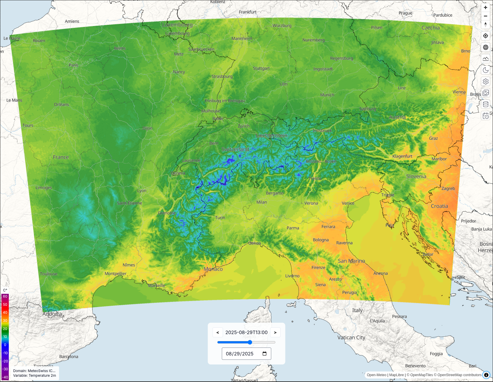

# Open-Meteo Maps

 

This repository showcases the Open-Meteo file protocol for MapLibre GL JS maps. The OM files used are hosted on a S3 storage which can be found [here](https://openmeteo.s3.amazonaws.com/). The weather API code can be found in [this](https://github.com/open-meteo/open-meteo) repository.

### ToDo

- Custom colour scales
- More elaborate documentation
