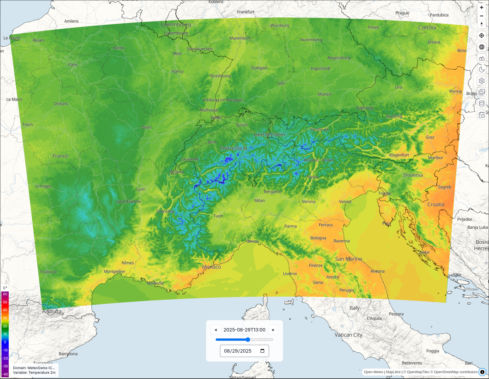

# Open-Meteo Maps

[](https://codecov.io/gh/open-meteo/maps)
[](https://github.com/open-meteo/maps/actions/workflows/build.yml)
[](https://github.com/open-meteo/maps/blob/main/LICENSE)

A UI demo for the [Open-Meteo Weather Map Layer](https://github.com/open-meteo/weather-map-layer) — a MapLibre/Mapbox GL JS weather layer powered by Open-Meteo OMfiles.



## About

This is a client-side app that fetches OMfiles from [openmeteo.s3.amazonaws.com](https://openmeteo.s3.amazonaws.com/index.html#data_spatial/) and renders them with MapLibre GL. Weather tiles are fully rendered in the browser at the native model resolution — no server-side tile rendering required.

> Looking for the Open-Meteo API? See [open-meteo/open-meteo](https://github.com/open-meteo/open-meteo).

## Development

```bash
npm install
npm run dev
```

Build for production:

```bash
npm run build
npm run preview
```

## Domain screenshots

`scripts/domain-screenshots.mjs` captures a reproducible screenshot of every model
domain for the website's model-area images. It drives the app in a headless browser
via a screenshot mode (`?screenshot=1&domain=<value>`), which hides all UI chrome,
frames the domain, draws a blue outline around its true footprint and signals when
the frame is fully rendered.

```bash
npm run screenshots                         # all regional domains → ../open-meteo-website/static/images/models
npm run screenshots -- --only=dwd_icon_eu,ncep_hrrr_conus
npm run screenshots -- --list               # print the domain list
```

Two overlay figures ride along in the same script, drawn on the plain base map with no
weather data: `--satellites` (geostationary satellite coverage, for the Satellite
Radiation API docs) and `--best-match` (the regions the Forecast API's `best_match`
model selection routes to, captured as a Europe close-up and a world view).

```bash
npm run screenshots -- --best-match         # best_match_regions_{europe,world}.webp
npm run screenshots -- --best-match --dark  # …and the _dark variants
```

Global models and the `*_seamless` composites are skipped by default
(`--include-global` / `--include-seamless` to include them). Size/quality/framing
are tunable: `--width --height --scale --quality --padding`. Requires `playwright`
(with the Chromium browser installed) and `sharp` (resolved from the website
project) for webp encoding. The dev server is started on port `5173` because the
tile/style hosts only allow CORS from that origin.

## Issues & Contributing

- Open issues and PRs in this repository for UI/demo-related changes.
- For issues with the weather map layer itself, see the [weather-map-layer issues](https://github.com/open-meteo/weather-map-layer/issues).
